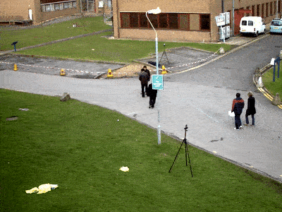
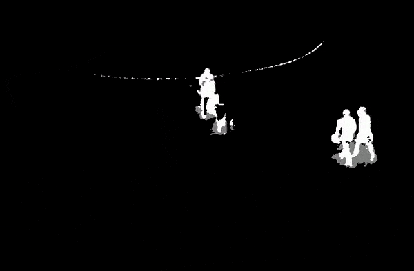

# Parallel Background Subtraction

[![License][license-image]][license-url]

Background subtraction using OpenCV. parallelized using MPI.

|              Input               |               output               |
| :------------------------------: | :--------------------------------: |
|  |  |

## Installation

- Install [Python](https://www.python.org/)
- Install MPI
- Install Dependencies

```bash
py -m venv venv
venv/Scripts/pip install install -r requirements.txt
```

## Usage

Place the video file in the input folder and update ``INPUT_FILE`` in ``__main__.py``.

```bash
venv/Scripts/python -m remaining-be-champions
```

## License

This project is licensed under the MIT License - see the [LICENSE](LICENSE) file for details

[license-image]: https://img.shields.io/badge/License-MIT-brightgreen.svg
[license-url]: https://opensource.org/licenses/MIT
